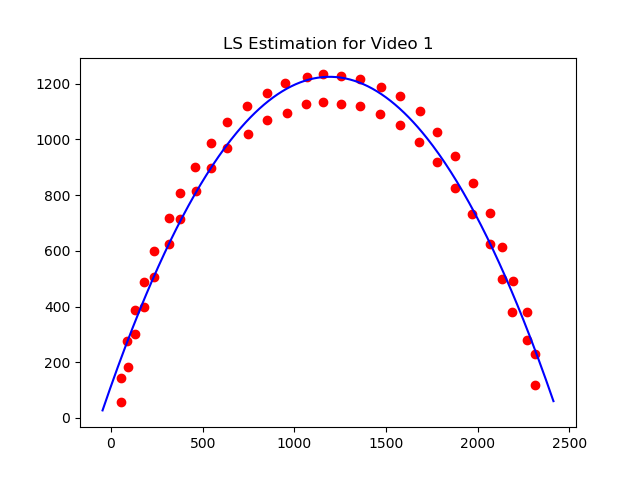
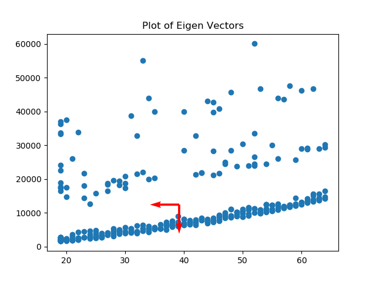
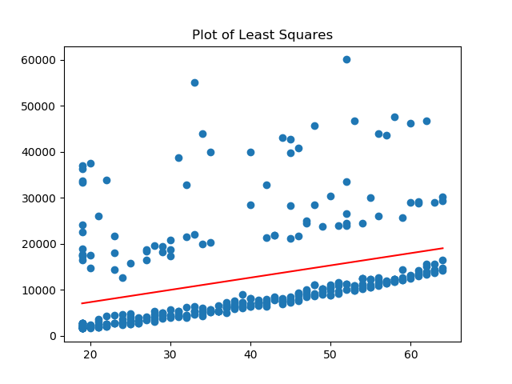
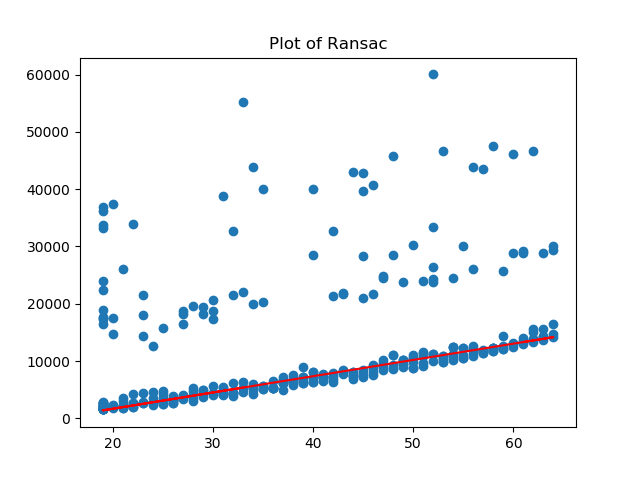
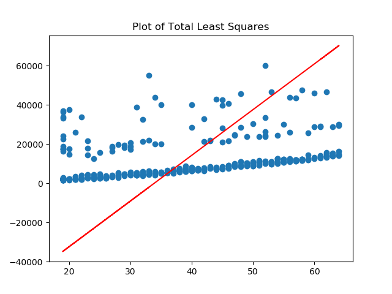

# Curve-Fitting-and-Homography

 ## How to Run:
 * Navigate to root of this package and run each python file  

## Results

<table>
 <tr>
   <td></td>
   <td></td>
 </tr>
 <tr>
   <td></td>
   <td></td>
 </tr>
 <tr>
   <td></td>
   <td></td>
 </tr>
</table>


## Folder Structure :
```
📦Curve-Fitting-and-Homography
 ┣ 📂Resources
 ┃ ┣ 📜ENPM673_hw1_linear_regression_dataset - Sheet1.csv
 ┃ ┣ 📜ball_video1.mp4
 ┃ ┗ 📜ball_video2.mp4
 ┣ 📂Results
 ┃ ┣ 📂Q2
 ┃ ┃ ┣ 📜Q2_1.png
 ┃ ┃ ┗ 📜Q2_2.png
 ┃ ┣ 📂Q3
 ┃ ┃ ┣ 📜Q3_EigenVectors.png
 ┃ ┃ ┣ 📜Q3_LS.png
 ┃ ┃ ┣ 📜Q3_RANSAC.png
 ┃ ┃ ┗ 📜Q3_TLS.png
 ┃ ┗ 📂Q4
 ┃ ┃ ┗ 📜Q4.png
 ┣ 📜ENPM673_hw1_report.pdf
 ┣ 📜Q2_1.py
 ┣ 📜Q2_2.py
 ┣ 📜Q3.py
 ┣ 📜Q4.py
 ┗ 📜README.md
 ```
